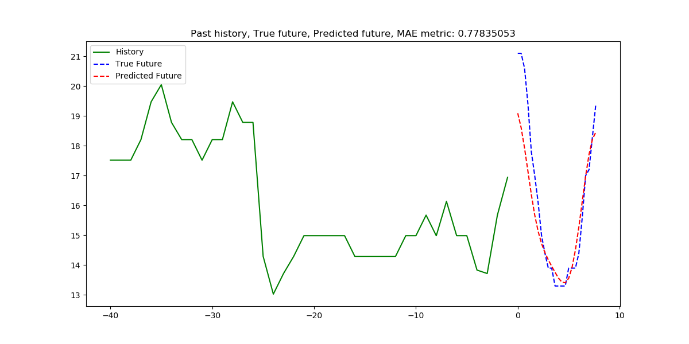
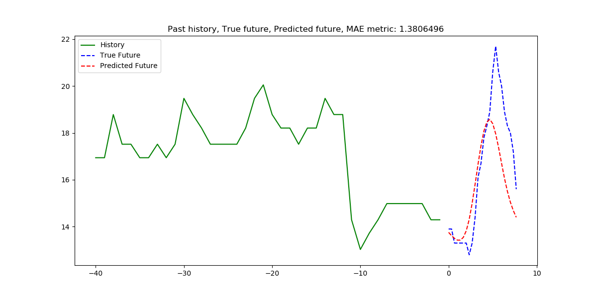
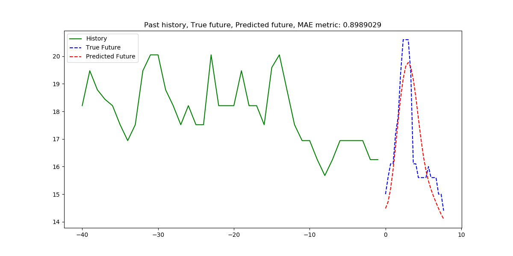
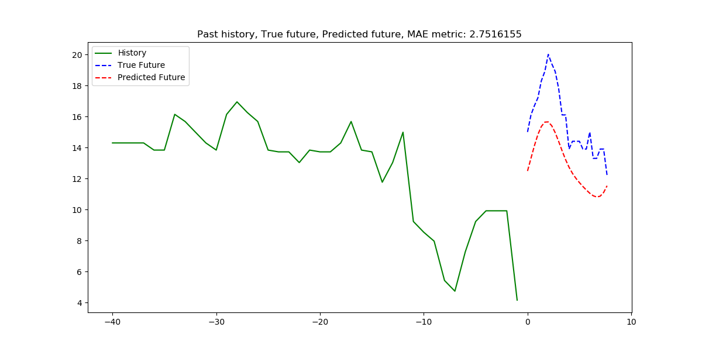
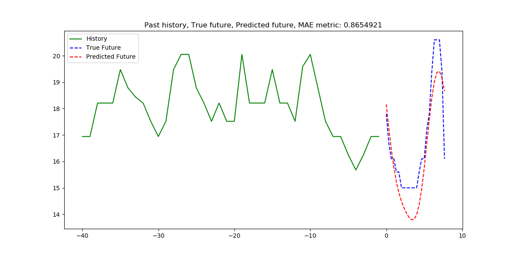

Learning curve for 5 epochs of training

Sample predictions: real unnormalized values and their calculated mean absolute error

Neural network architecture and its evaluated Huber loss (smooth mean absolute error loss) (normalized)

